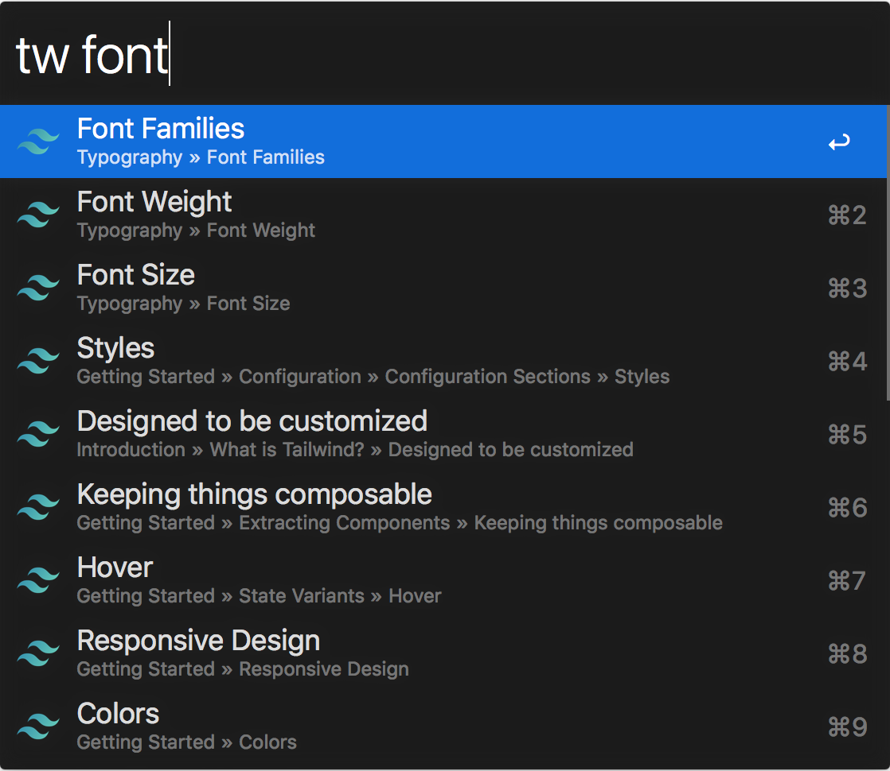

# TailwindCSS Docs Workflow for Alfred

An ultra-fast TailwindCSS docs search workflow for Alfred 4+

Adapted from [Alfred VueJS Docs](https://github.com/vmitchell85/alfred-vuejs-docs), which is adapted from [Alfred Laravel Docs](https://github.com/tillkruss/alfred-laravel-docs), Thanks [Till Krüss](https://twitter.com/tillkruss)!



## Installation


> **macOS Monterey:** PHP is no longer shipped with macOS, before attempting to use this workflow ensure you have installed the php binary via Homebrew.

1. [Download the latest version](https://github.com/clnt/alfred-tailwindcss-docs/releases/download/v2.0.1/TailwindCSSDocs.alfredworkflow)
2. Install the workflow by double-clicking the `.alfredworkflow` file
3. You can add the workflow to a category, then click "Import" to finish importing. You'll now see the workflow listed in the left sidebar of your Workflows preferences pane.

## Usage

To search the [v2 docs](https://tailwindcss.com/docs), just type `tw` followed by your search query.

```
tw <query>
```

To search the [v0 docs](https://v0.tailwindcss.com/docs), just type `tw0` followed by your search query.

```
tw0 <query>
```

To search the [v1 docs](https://v1.tailwindcss.com/docs), just type `tw1` followed by your search query.

```
tw1 <query>
```


