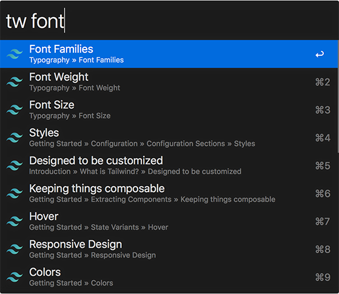

# TailwindCSS Docs Workflow for Alfred

An ultra-fast TailwindCSS docs search workflow for Alfred 3.

Adapted from [Alfred VueJS Docs](https://github.com/vmitchell85/alfred-vuejs-docs), which is adapted from [Alfred Laravel Docs](https://github.com/tillkruss/alfred-laravel-docs), Thanks [Till Krüss](https://twitter.com/tillkruss)!



## Installation

1. [Download the latest version](https://github.com/clnt/alfred-tailwindcss-docs/releases/download/1.0.0/TailwindCSS.Docs.alfredworkflow)
2. Install the workflow by double-clicking the `.alfredworkflow` file
3. You can add the workflow to a category, then click "Import" to finish importing. You'll now see the workflow listed in the left sidebar of your Workflows preferences pane.

## Usage

Just type `tw` followed by your search query.

```
tw <query>
```

To search the [v0 docs](https://v0.tailwindcss.com/docs), just type `tw0` followed by your search query.

```
tw0 <query>
```

To search the [beta docs](https://next.tailwindcss.com/docs), just type `twb` followed by your search query.

```
twb <query>
```

